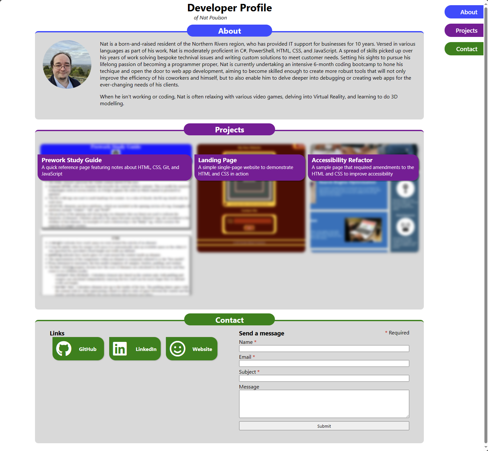

# Challenge 02 - Personal Web Portfolio and Gallery
## Description
This is a challenge submission for the second coding challenge for the University of Sydney Coding Bootcamp.
If I'm honest, I'm not thrilled with how this turned out. I feel like I need to spend a lot more time with CSS to truly understand it, so that's going to be a point of focus for me now that I've completed this.
The goal was to develop a simple developer profile page, providing some information about ourselves, a small showcase of our work, and some links, all based on plans from a wireframe.

The practice with HTML went well, but things with the CSS fell apart rather quickly once getting into positioning nuances, that said I do feel like I've learned a bit more about CSS Flexbox in the process.
I also learned a bit a about including icon packs with the amazing Font Awesome Free Fonts pack.

Big apologies for the mess in the CSS, I didn't really have time to reorganise it the way I planned to initially.

## Preview

## Usage
- Responsive layout
    - When reducing the screen width horizontally, you should see the menu reorganise itself along the top to avoid conflicting with the rest of the page.
    - At lower resolutions, content will begin to stack automatically, such as the links over the contact form.
- The contact form does nothing functionally right now, its main purpose was to provide a layout for forms as part of the design.
- If you click on the nemu buttons at the side/top, you'll be taken to the respective section in the document.
- The tiles for the projects will fade in when you mouse over them, and clicking will take you to the respective deployed sites in a new tab.

## Credits
- Font Awesome Fonts: Download Font Awesome Free or Pro | Font Awesome. (2023, August 1). https://fontawesome.com
- Guidelines for Accessibility: How to Meet WCAG (Quickref Reference). (n.d.). Retrieved November 19, 2023, from https://www.w3.org/WAI/WCAG22/quickref/?versions=2.1
- Readme template used: Professional README Guide. (n.d.). Retrieved November 19, 2023 - Link not supplied due to it being proprietary material from edX and University of Sydney

## License
This project is licensed under the [MIT License](./LICENSE).
Font Awesome icons licensed under a combination of licenses as the [Font Awesome Free License](./assets/fa/LICENSE.txt), including:
- Icons: CC BY 4.0 License (https://creativecommons.org/licenses/by/4.0/)
- Fonts: SIL OFL 1.1 License
- Code: MIT License (https://opensource.org/licenses/MIT)